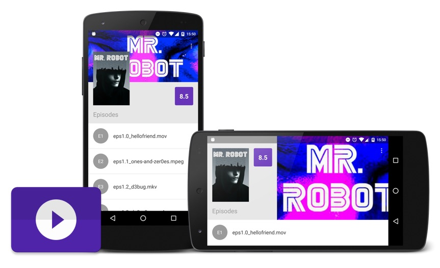

## Recrutamento Android - Movile

Projeto teste para processo seletivo da Movile.



## Sobre

O aplicativo consiste em um cliente simples do [Trakt.tv](http://trakt.tv) que trás informações de uma série, como a lista de episódios de uma temporada e outros detalhes, como imagens e rating.

Demonstração (Vídeo): [Link](https://www.youtube.com/watch?v=eCCA1L3BlWo)

## Detalhes do projeto

#### API
Trakt.tv (Docs): [http://docs.trakt.apiary.io/](http://docs.trakt.apiary.io/)


#### Arquitetura e Libraries

* Arquitetura MVP
* API mínima 16 e target 23
* Android Support Library 23.2.0
* Cliente REST/HTTP com Retrofit + OkHttp
* Carregamento de imagens com Picasso
* View binding com Butterknife
* Testes unitários com JUnit + Mockito
* Testes de UI com Espresso

#### Requisitos

* Layout diferente para landscape ✔︎
* Tratamento de erros (falta de conexão, erros do servidor) ✔︎
* Efeito parallax no cabeçalho ✔︎
* Tornar a toolbar opaca conforme o scroll da listagem de episódios ✔︎
* Testes automatizados ✔︎
* Layout diferente para tablet ou orientação landscape ✔︎

## Como gerar uma build?

Para fazer build do projeto é necessário criar um arquivo de nome `secret.properties` na raiz do projeto, contendo um Client ID válido do Trakt.tv no seguinte ormato:

```
API_KEY=your_client_id
```

Para conseguir o Client ID basta acessar [esse link](https://trakt.tv/oauth/applications/new) e criar uma nova aplicação no Trakt.tv.

Essa configuração é necessária pois dentro do `build.gradle` existe o método *getAPIKey* que lê o arquivo `secret.properties` e retorna o Client ID dinamicamente:

```groovy
def getAPIKey() {
   	def Properties props = new Properties()
    props.load(new FileInputStream(new File('secret.properties')))
   	return props['API_KEY']
}
```

Dessa forma, podemos criar um *buildConfigField* custom no `app/build.gradle`:

```groovy
buildConfigField "String", "API_KEY", "\""+getAPIKey()+"\""
```
E acessar esse valor dentro do projeto, através de uma constante da classe `BuildConfig.java`, que gerada automaticamente após o build do Gradle:

```java
BuildConfig.API_KEY
```

Esse apprach é recomendado pois evita que o Client ID seja commitado junto com o projeto.

## Licença

The MIT License (MIT)

Copyright (c) 2016 Walmyr Carvalho

Permission is hereby granted, free of charge, to any person obtaining a copy
of this software and associated documentation files (the "Software"), to deal
in the Software without restriction, including without limitation the rights
to use, copy, modify, merge, publish, distribute, sublicense, and/or sell
copies of the Software, and to permit persons to whom the Software is
furnished to do so, subject to the following conditions:

The above copyright notice and this permission notice shall be included in all
copies or substantial portions of the Software.

THE SOFTWARE IS PROVIDED "AS IS", WITHOUT WARRANTY OF ANY KIND, EXPRESS OR
IMPLIED, INCLUDING BUT NOT LIMITED TO THE WARRANTIES OF MERCHANTABILITY,
FITNESS FOR A PARTICULAR PURPOSE AND NONINFRINGEMENT. IN NO EVENT SHALL THE
AUTHORS OR COPYRIGHT HOLDERS BE LIABLE FOR ANY CLAIM, DAMAGES OR OTHER
LIABILITY, WHETHER IN AN ACTION OF CONTRACT, TORT OR OTHERWISE, ARISING FROM,
OUT OF OR IN CONNECTION WITH THE SOFTWARE OR THE USE OR OTHER DEALINGS IN THE
SOFTWARE.


